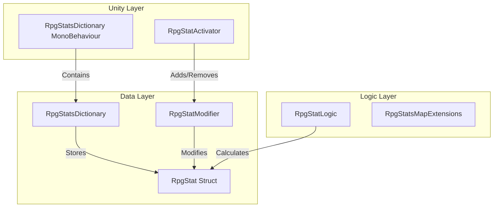

# AV.RpgStats

Data-oriented RPG stat system with high-performance modifier support.

## ✨ Features

- **Stat System**: Base Value + Modifiers = Current Value.
- **Modifiers**: Add, Multiply, etc., with support for Timer-based expiration.
- **Targeting**: Apply modifiers to Self, Target, Source, etc.
- **Dictionary Lookup**: Efficient ID-based stat retrieval.

## 📦 Installation

Install via Unity Package Manager (git URL).

### Dependencies
- **Variable.RPG** (NuGet)
- **AV.Lifetime**
- **AV.CancelFoldout**
- **AV.DictionaryVisualizer**

## 🚀 Usage

1. Create `RpgStatScript` assets (Health, Mana).
2. Add `RpgStatsDictionary` to character.
3. Use `RpgStatActivator` to apply modifiers on Enable/Disable.

## ⚠️ Status

- 🧪 **Tests**: Missing.
- 📘 **Samples**: Included in `Samples~`.

## 🔍 Deep Dive

### Internal Architecture
The system uses a Data-Oriented approach where data (Structs) is separated from Logic (Static Classes).

